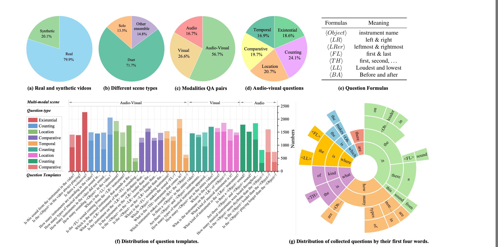
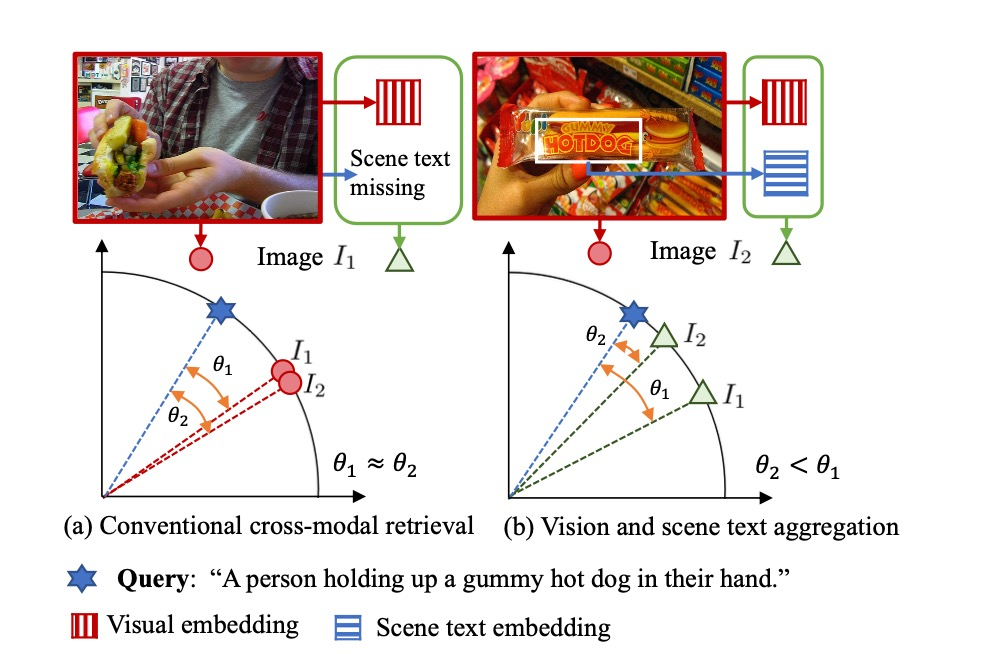
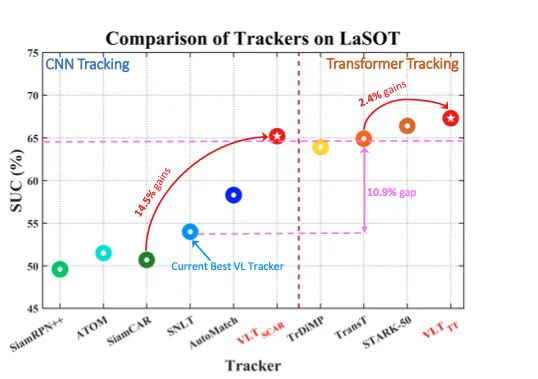

# 1 科研方法
本文研究领域为：机器学习、计算机视觉。

## 大道至简

+ 学会优化，当事情复杂的时候，停下来想尽办法去优化

+ 不要用体力上的劳动代替脑力劳动

+ 不要盲目努力，学会选择

+ 找简单的工具，方便自己工作

## 相关资源

+ [如何做PhD？](https://github.com/shengyp/doing_the_PhD)

+ [助理教授/博士生生存指南](https://github.com/JunweiLiang/awesome_lists)

+ [文章写作技巧](https://github.com/MLNLP-World/Paper-Writing-Tips)

+ [顶会论文写作建议](https://zhuanlan.zhihu.com/p/593195527?utm_campaign=shareopn&utm_medium=social&utm_oi=1260929451040067584&utm_psn=1601593849972994048&utm_source=wechat_session)

# 2 如何准备顶会文章？

## 会议查询和截止日期
+ [AI Conference Deadlines](https://aideadlin.es/?sub=ML,CV)
+ [CCF Conference Deadlines](https://ccfddl.github.io/)

## 写文章工具

+ 写文章 [https://www.overleaf.com/](https://www.overleaf.com/)

+ 题目名缩写 [https://acronymify.com/](https://acronymify.com/)

+ 文字润色 [https://quillbot.com/](https://quillbot.com/) 和 [https://app.grammarly.com/](https://app.grammarly.com/)

## 可视化资源
+ [OriginLab](https://www.originlab.com/Origin)
+ [Python-graph-gallery](https://www.python-graph-gallery.com/)
+ [Python-seaborn](https://seaborn.pydata.org/)
+ [Python-pyecharts](https://github.com/pyecharts/pyecharts)
+ [Python-plotpy](https://plotly.com/python/)
+ [IconFont](https://www.iconfont.cn/)

## 数据集展示

## 实验用图风格

更多[实验流程图](./doc/flowchart.md)

## 结果可视化方法

更多[可视化方法](./doc/visualization.md)

<!--
# 如沐春风

+ 作为一个努力的人，一天工作10个小时，非常正常，我想实验室现在工作时间大于我的人不多，我起码都是10个小时工作时间

+ 谁要这一个月内，不认真学习，出去闹腾，无论是谁，直接离开实验室

+ 讲理由之前，请收拾干净桌子，直接离开

+ 这10天，谁去干其他的事情，无论访问、学生还是员工，请立马辞职离开

+ 不同意的学生，请及时找好下家

+ 如果一个idea还在讨论的时候，你说肯定不行，那你肯定不是xx课题组的成员

+ Deadline来了 难道你们现在不感到兴奋吗？
-->
