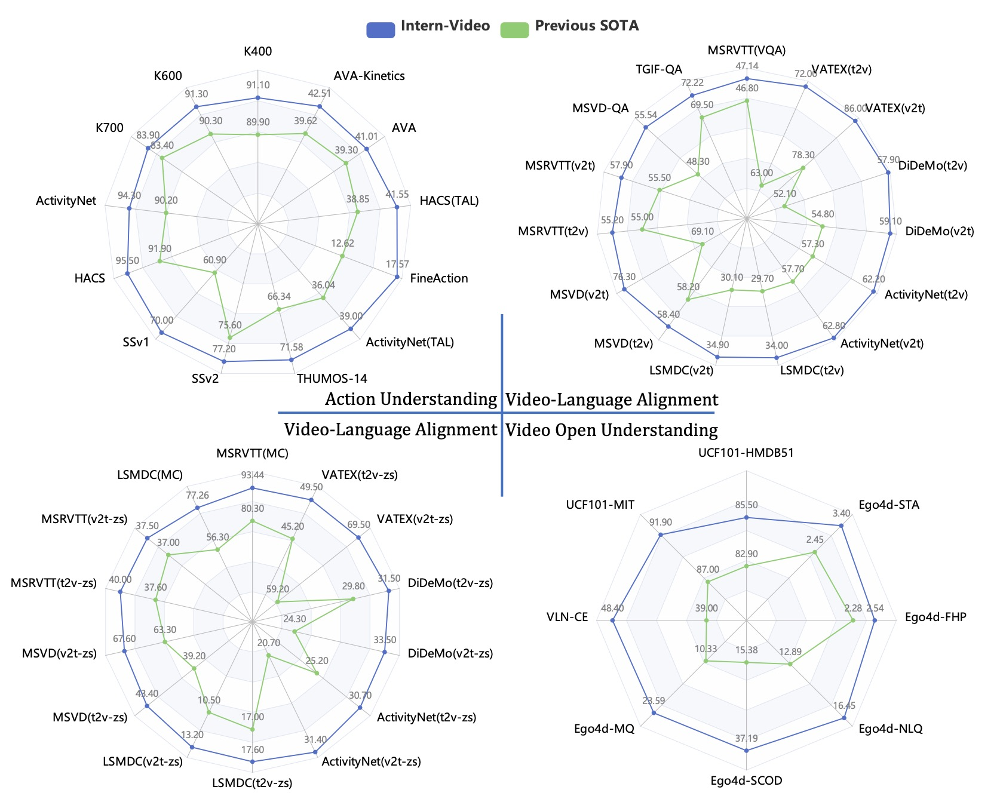

# 科研方法

+ 学会优化，当事情复杂的时候，停下来想尽办法去优化

+ 不要用体力上的劳动代替脑力劳动

+ 不要盲目努力，学会选择

+ 找简单的工具，方便自己工作

# 如何准备顶会文章？

# 实例：实验用图风格

# 实例：结果可视化方法

----

----

## 可视化资源
+ [seaborn] (https://seaborn.pydata.org/)
+ [pyecharts] (https://github.com/pyecharts/pyecharts)
+ [plotpy] (https://plotly.com/python/)
+ [Python-graph-gallery](https://www.python-graph-gallery.com/)
+ [origin] https://www.originlab.com/Origin

# 相关资源

+ [Doing the PhD](https://github.com/shengyp/doing_the_PhD)

+ [助理教授/博士生生存指南](https://github.com/JunweiLiang/awesome_lists)

+ [Paper Writing Tips](https://github.com/MLNLP-World/Paper-Writing-Tips)

# 至理名言
<!--
# 如沐春风

+ 作为一个努力的人，一天工作10个小时，非常正常，我想实验室现在工作时间大于我的人不多，我起码都是10个小时工作时间

+ 谁要这一个月内，不认真学习，出去闹腾，无论是谁，直接离开实验室

+ 讲理由之前，请收拾干净桌子，直接离开

+ 这10天，谁去干其他的事情，无论访问、学生还是员工，请立马辞职离开

+ 不同意的学生，请及时找好下家

+ 如果一个idea还在讨论的时候，你说肯定不行，那你肯定不是xx课题组的成员

+ Deadline来了 难道你们现在不感到兴奋吗？
-->
